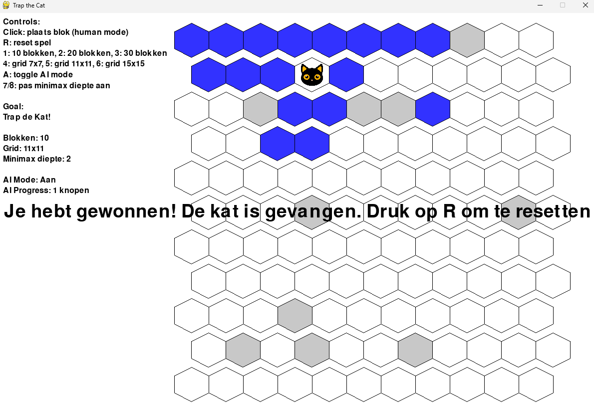

# Trap-The-Cat-AI

## Inhoudsopgave

- [Introductie](#introductie)
- [Doelstellingen](#doelstellingen)
- [Probleemstelling](#probleemstelling)
- [Analyse](#analyse)
- [Resultaat](#resultaat)
- [Uitbreiding](#uitbreiding)
- [Conclusie](#conclusie)
- [Bibliografie](#bibliografie)

---

## Introductie

Dit project gaat voor het toepassen van Artificial Intelligence en Machine Learning om het op lossen van het spel trap the cat. Het doel is om met een techniek van Machine Learning de kat te laten vangen.

### Team

- Sam De Wispelaere
- Joren Vandewalle

---

## Doelstellingen

### Hoofddoelen

- **Game**
  Er moet een user friendly game gemaakt worden die makkelijk verstaanbaar is en er goed uitziet.
- **Algoritme kat**
  Voor het spel moet een Algoritme toegevoegd worden voor de kat, deze moet de snelste route naar het ontsnappen vinden.
- **Vangen kat (ML)**
  Door middel van Machine Learning moet een AI de kat kunnen vangen, dit kan bijvoorbeeld door Reinforced Learning hierbij zal de AI zich verbeteren door middel van straffen en rewards.

### Subdoelen

- **Uitbreidbaar speelveld**
  Het spel moet makkelijk uitbreidbaar zij, zoals de grote van het speelveld of het aantal vooraf geblokkeerde vakken.
- **Visuele weergave**
  Dit sluit aan op het user friendly maken van het spel, het visueel maken van het spel zal alles duidelijk maken.

---

## Probleemstelling

- **Moeten we zelf nog het spel programmeren of kunnen we ergens het spel downloaden?**
  Is er online bijvoorbeeld een .exe file waardoor we deze gewoon kunnen gebruiken en een AI kunnen implementeren. Of moeten we deze zelf nog maken. We hebben gekozen om het zelf nog te maken, hierdoor kunnen we alles zelf bepalen en kunnen we sneller aan een AI beginnen.
- **Maken we een Machine Learning AI voor de kat of om de kat te vangen?**
  Willen we een Machine Learning model voor de kat zodat de user tegen een AI kan spelen. Of willen we dat een AI de kat probeert te vangen. Het meest logische is zeker dat er een AI de kat probeert te vangen waar wij ook direct voor gingen.
- **Hoe gaan we Machine Learning implementeren in Trap the cat?**
  Hoe we AI Machine Learning kunnen implementeren in het spel. We dachten eerst aan (RL) Reinforced Learning. Hierbij door straffen en beloningen kan de AI zichzelf bijleren.
- **Wat kunnen de moeilijkheden zijn bij het gebruik van Machine Learning in dit project?**
  Omdat er zoveel mogelijke situaties zijn en zelfs al 1 blokje wordt geblokkeerd dan maakt dit meestal niet heel veel uit, behalve als het de kat omsingeld of een gat van 1 blokje opvult. Hierdoor is het ook moeilijk om een goede beloningsstructuur te vinden. Als de AI de kat laat ontsnappen of volledig vast zet dan is het simpel, maar voor een blok te blokkeren ergens midden in het speelveld is dit moeilijk. Ook is het elke keer een nieuw random startveld wat het niet makkelijk maakt om te leren. Dit hebben we verder in het project gezien wanneer we ML gebruikten. Hierdoor zijn we overgegaan naar een algoritme, deze leert niet zelf bij jammer genoeg.

---

## Analyse ** 500 woorden **

### 1. Reinforced learning

Ons doel eerst was om met Machine Learning te werken, en zo een AI maken die de kat probeert te vangen. Hiervoor dachten we eerst aan de techniek Reinforced Learning. Hier hebben we een RL agent gebruikt. Het is een Deep Q netwerk (DQN) dit leert welke cel hij moet blokkeren zodat het de beste kans geeft om de kat te vangen. Maar tijdens het trainen (zelfs met 20000 episodes) had de AI buiten de eerste 100 steeds dezelfde rewards en epsilon. Gewichten werden opgeslagen en verder gebruikt. Uiteindelijk bij het gebruiken van de AI in het spel, leek het of hij enkel random moves deed.

- **DQN agent:**
  Dit is een agent die door het gebruik van een neuraal netwerk Q waarden gaat voorspellen voor alle mogelijke zetten. Er worden dan gewichten opgeslagen op die door de training worden aangepast, dit omdat de agent dan leert om de beste mogelijke acties te kiezen. Deze gewichten zijn eigenlijk de opgedane kennis van de AI.

- **Beloningsfunctie:**
  Dit hebben we vaak aangepast en andere waarden gebruikt. Voor als de kat ontsnapt of juist gevangen wordt dan is het simpel krijgt het een goede of slechte reward. Maar bij andere zetten is dit moeilijk te zeggen. Bijvoorbeeld bij een zet ergens midden in het veld dan is het wel positief doordat er minder mogelijke acties zijn, maar als het maar 1 vakje is die volledig omringt is door lege vakken is dit niet perse slecht of goed. Wel als er bijvoorbeeld een volledige rij wordt vast gezet waardoor de kat er ook niet makkelijk rond kan.

### 2. MinMax algoritme

  Doordat het niet lukte met de Machine Learning Ai, zijn we overgaan naar een algoritme. Uiteindelijk gebruiken we het MinMax algoritme.
  De reward function van de minmax word geregeld door de afstand van de kat naar de zijkant. Het algoritme zoekt een afstand zo hoog mogelijke binnen de ingestelde diepte. Maar een kat die ingeblokt zit word gezien als een reward van 1000 waardoor deze altijd gekozen word. En een kat die op de rand staat en dus ontsnapt heeft een reward van -1000. Hierbij word ook alpha beta pruning gebruikt om onnedige berekeningen weg te laten en efficienter te werken. 

## Resultaat ** 500 woorden **

### Overzicht

In ons project hebben we een spel gemaakt waarin de speler de kat kan proberen vangen door op een slimme manier de blokken te plaatsen. Er is een gebruiksvriendelijke interface, waarbij de instellingen zoals het bord size eenvoudig aanpasbaar is. De bedoeling was om door het gebruik van een techniek in machine learning een AI te maken die de kat kan vangen. Dit is ons niet gelukt en daarom hebben we uiteindelijk overgeschakeld naar het minmax algoritme. Deze zal door evaluatiefuncties en zoekdieptelimieten uitzoeken wat de beste zet is om de kat te vangen.

### MinMax algoritme

We hebben een werkend algoritme. Deze is zeker nog niet optimaal maar is veel sterker in het trappen van de kat tegenover het ML model. Dit algoritme gaat op voor de max (Ai) op zoek naar de maximale beloning, terwijl de min (Kat) de beloning zo klein mogelijk houd. De beloning wordt bepaalt door de afstand van de kat tegenover de rand van het spel. Hoe verder de kat van de rand is hoe hoger de reward. Voor als een kat getrapped wordt krijgt die een reward van 1000, als de kat ontsnapt is het -1000. Bij het algoritme wordt ook alpha-beta pruning gebruikt. Dit zorgt ervoor dat onnodige bewerkingen gebeuren en zo berekeningen efficiënter zijn. Dit doordat de takken van de boom waar er geen betere uitkomst is worden afgebroken.

### Visualisatie

Voor de visualisatie gebruiken wij pygame. Er zijn 2 delen, links heb je de settings en wat info en recht heb je het spelbord. Het spelbord is gemaakt uit hexagonale cellen. Deze worden dynamisch getekend met verschillende kleuren afhankelijk van de status.

- **Witte cellen:**
Vrije blokken.
- **Grijze cellen:**
Randomize pre placed blokken, of blokken die de user heeft geplaatst.
- **Blauwe cellen:**
Blokken geplaats door de AI.
- **Flikerende rode cellen:**
Is tijdelijk tijdens de evaluatie door het algoritme.

De kat wordt afgebeeld als een afbeelding van een kat, als deze foto niet gevonden wordt dan komt er een blauwe cirkel. De layout zorgt ervoor dat het spelbord altijd gecentreerd staat ook bij het aanpassen van de grote. De visuele effecten geven ook de werking van het minmax algoritme, hierdoor zie je waar het algoritme mee bezig is.

### Code

De code voegt het spel en het algoritme samen. Voor de kat wordt het A* algoritme gebruikt. Het spelbord wordt dynamisch berekent en is zo zeker ook aanpasbaar. Door het gebruik van threading blijft de interface aanpasbaar en loopt dit niet vast.

#### Libraries

- **pygame:**
  Wordt gebruikt voor de grafische interface.
- **random:**
  Zorgt voor willekeurige getallen, gebruiken we voor random pre placed blokken te plaatsen.
- **heapq:**
  Wordt gebruikt bij het A* algoritme, vindt efficiënt de knoop met de laagste kosten.
- **math:**
  Geeft toegang tot wiskundige functies die gebruikt worden in het algoritme.
- **threading:**
  Gaat ervoor zorgen dat de game niet vastloopt terwijl er berekeningen gebeuren, deze berekeningen gebeuren op de achtergrond.
- **time:**
  Wordt momenteel niet gebruik, maar zorgt voor bijvoorbeeld een timer in het spel.
- **collections.deque:**
  Het uitvoeren van queue operaties.

---

## Uitbreiding

- **Sterker AI:**
  Natuurlijk de eerste uitbreiding die hierbij zou komen is een sterkere AI of een AI met machine learning.
- **.exe file:**
  Daarna is een .exe file ook een goede uitbreiding moest er een Machine Learning AI zijn. Dit maakt het voor de user gemakkelijk en iedereen kan dit gebruiken.

---

## Conclusie ** 200 woorden **

Als we kijken naar onze doelstellingen dan hebben we zeker een user friendly game die makkelijk verstaanbaar is. Er kan zonder moeilijkheden een spel gespeeld worden en de settings zijn duidelijk. Er is geen ML AI in het spel, dit is de belangrijkste doelstelling en het is niet aanwezig wat zeer jammer is. In plaats daarvan zit er een algoritme in wat werkt maar zeker nog niet optimaal is, hij verliest nog teveel.